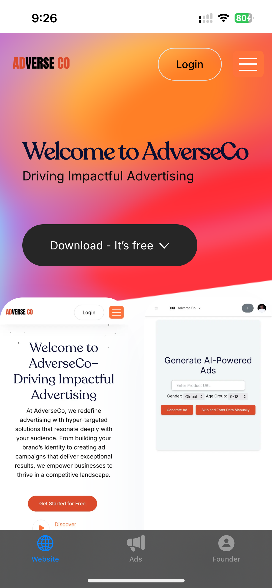
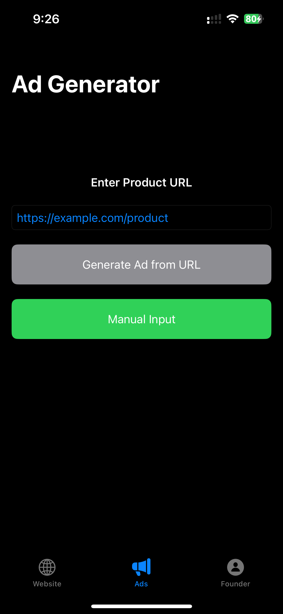

# AdverseCo iOS App

AdverseCo is a SwiftUI-based iOS application designed to showcase digital advertising solutions. The app provides a native experience with three main sections:

  
  
  


- **Website:** Displays the company’s landing page.
- **Ads:** Allows users to generate digital ad content either by providing a product URL or manually entering product information. Users can also upload an image for the ad preview.
- **Founder:** Presents information about the founder, Avanish Singh, along with social media links.

## Features

- **Native Home Page:** A SwiftUI recreation of the AdverseCo home page with hero image, welcome text, and call-to-action.
- **Ad Generation:** 
  - URL-based ad generation: Sends a product URL to a backend service to scrape product data and generate ad copy.
  - Manual ad creation: Users can manually input product details to generate ad copy.
  - Image upload: Users can upload a custom image for the ad preview using PHPicker.
- **Founder Info:** A dedicated page that shows the founder’s bio and provides links to social media profiles.
- **Tabbed Navigation:** Uses a TabView for smooth navigation between Website, Ads, and Founder pages.

## Requirements

- iOS 14 or later
- Xcode 12 or later
- Swift 5

## Installation

1. **Clone the Repository:**

   ```bash
   git clone https://github.com/aaviix/AdverseCo-IOS.git
   ```

2. Open the Project:
    Open AdverseCo.xcodeproj in Xcode.

3. Add Assets:
    - Website & Founder: Ensure that your assets (e.g., hero, logo, founder) are added to the Assets.xcassets folder.
    - For the founder image, add your image file (e.g., founder.jpeg) to Assets.xcassets and rename it to founder (without extension).

4. Configure Info.plist:
    - Add the following keys to your Info.plist file if they’re not already present:

    ```bash
    <key>NSPhotoLibraryUsageDescription</key>
    <string>This app requires access to your photo library to allow image uploads for ads.</string>
    <key>NSCameraUsageDescription</key>
    <string>This app requires access to your camera to capture images for ads (if needed).</string>
    ```
## Running the App

1. Select a Target:
    - Choose an iOS Simulator or a physical device.

2. Build and Run:
    - Press Command+R in Xcode to build and run the app.

3. Using the App:
    - Website Tab: Displays the live company website.
    - Ads Tab:
        - Enter a product URL to generate an ad or choose manual input to enter product details.
        - Upload an image if desired using the PHPicker.
        - Preview your generated ad with a native layout.
    - Founder Tab: View information about the founder and tap on social media links (LinkedIn, GitHub, Personal Website).

## Project Structure

1. AdStore.swift:
    - Contains the data model (ProductData) and the observable object (AdStore) for storing ad information.

2. WebsiteView.swift:
    - Implements a WebView using WKWebView to display the company website.
    
3. FounderView.swift:
    - Contains the founder’s bio and social media links.

4. AdCreationView.swift:
    - Contains the ad generation flow, including:
        - LandingView: URL-based ad generation.
        - ManualInputView: Manual ad creation.
        - AdvertisementView: Ad preview with image upload.
        - AdPreviewView: Displays the ad image (either from the backend URL or an uploaded image).
        - PhotoPicker: Uses PHPickerViewController for image selection.

5. ContentView.swift:
    - Connects the Website, Ads, and Founder pages using a TabView.

## Backend Integration

The app communicates with a backend service at:

    - URL-based ad generation:
        - https://adverseco.herokuapp.com/createAd
    - Manual ad generation:
        - https://adverseco.herokuapp.com/generateAdPrompt

Ensure your backend is running and returns valid JSON with keys like adCopy, brandName, productName, productDescription, targetAudience, uniqueSellingPoints, and imageUrl.

## Contact

For questions or feedback, please contact singhavanish8642@gmail.com